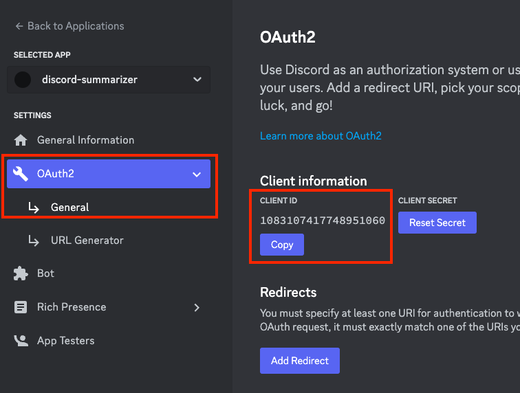
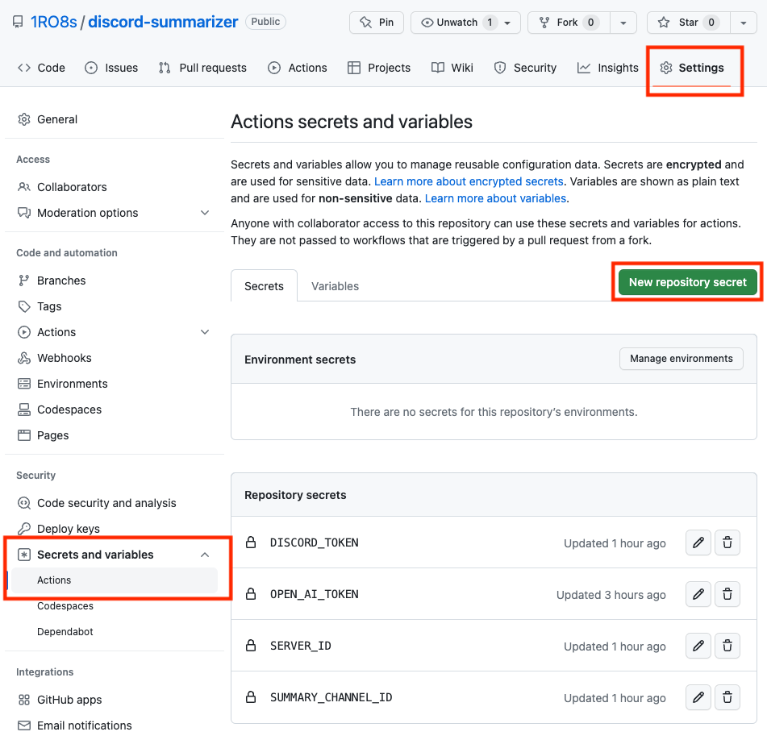
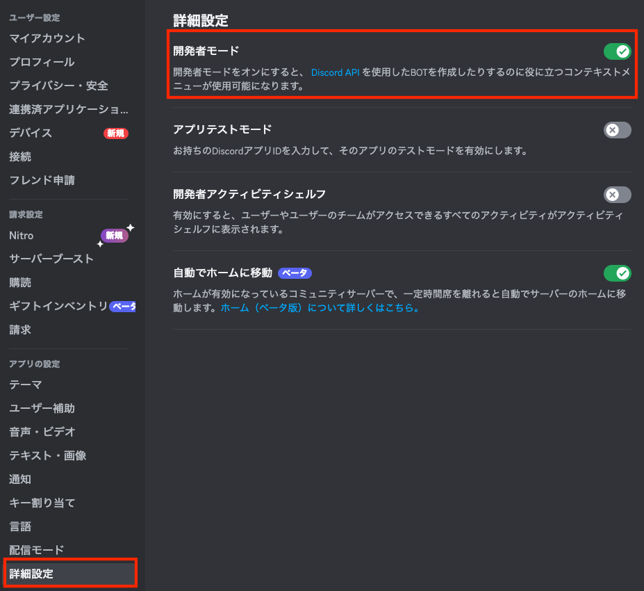

# ChatGPT を使って Discord の Public channel をまとめて要約するスクリプト

by [1RO8s](https://twitter.com/kizzo168) 2023-[APACHE LICENSE, 2.0](https://www.apache.org/licenses/LICENSE-2.0)

ChatGPTを使ってDiscordのPublic channnelの要約を投稿するスクリプトです。

[masuidrive](https://twitter.com/masuidrive)さんが開発された[Slack版](https://github.com/masuidrive/slack-summarizer)をもとにしています。

OpenAI の情報取扱に関する規約は下記などを確認してください。

[API data usage policies | OpenAI](https://platform.openai.com/docs/data-usage-policies)


## 機能
- 動作時刻の25時間前までのチャットを要約し、指定したチャンネルに投稿。
- GitHub Actions で毎日午前5時に動く。
- 全てのパブリックチャンネルが対象

## 利用方法

### 自分のGitHubアカウントにforkする
- 右上の"Fork"ボタンを押して、自分のリポジトリにforkします
- 有料プランにするなどして GitHub Actions が実行できるようにしておきます

### Discord botを作成する

[Botアカウント作成](https://discordpy.readthedocs.io/ja/latest/discord.html)

### botの招待

- [Developer Portal](https://discord.com/developers/applications)にて、作成したアプリケーションのページを開く
- OAuth2 -> Generalを開き、CLIENT ID の"Copy"を押して値を取得しておく



- 以下のURLを開いて、対象のサーバーにbotを招待する。YOUR_CLIENT_IDには上記で取得した CLIENT ID を設定する。
```
https://discord.com/api/oauth2/authorize?client_id=YOUR_CLIENT_ID&permissions=67584&scope=bot
```
> Send Messages、Read Message Historyを許可します

### Botの権限を追加する
- [Developer Portal](https://discord.com/developers/applications)にて、作成したアプリケーションのページを開く
- Botメニューを開き、MESSAGE CONTENT INTENTを有効化する


### 環境変数を設定する
- "Settings"タブを開き、左の"Secrets and variables" -> "Actions"を開きます
- 右上の緑の"New Repository Secret"をクリックすると環境変数が設定できるので、次の 4 つの変数を設定します



#### DISCORD_TOKEN

#### OPEN_AI_TOKEN
- OpenAI の認証トークン
- [OpenAI の Web サイト](https://platform.openai.com/)にアクセスしてください
- 右上の"Sign In"ボタンをクリックし、アカウントにログインしてください
- ページ上部の"API"メニューから、"API Key"をクリックして、API キーを生成します
- "API Key"ページにアクセスすると、API キーが表示されます。これをコピーして Value に貼り付けます

#### SERVER_ID
- Discordの[開発者モードを有効化](#開発者モードの有効化)しておく
- 対象のサーバーに移動後、サーバー名を右クリックして、メニューから「IDをコピー」を選択
- コピーした値をValue に貼り付けます


#### SUMMARY_CHANNEL_ID
- 対象サーバーにサマリ投稿用のチャンネルを作成する
- Discordの[開発者モードを有効化](#開発者モードの有効化)しておく
- 投稿用チャンネルに移動後、チャンネル名を右クリックして、メニューから「IDをコピー」を選択
- コピーした値をValue に貼り付けます

### 実行
- GitHub のリポジトリで"Settings"タブを開き、左の"Actions"→"General"を開きます
- "Actions permissions"の"Allow all actions and reusable workflows"を選択して保存してください

これらの設定をすると、毎日午前 5 時に Discord の Public channel の要約結果が投稿されます。

手動で実行してみる場合には"Actions" タブを開き、左の"discord-summarizer"をクリックして、右の"Run workflow"をおしてください。

---

#### 開発者モードの有効化
- ユーザー設定を開き、詳細設定 -> 開発者モードをONにする

