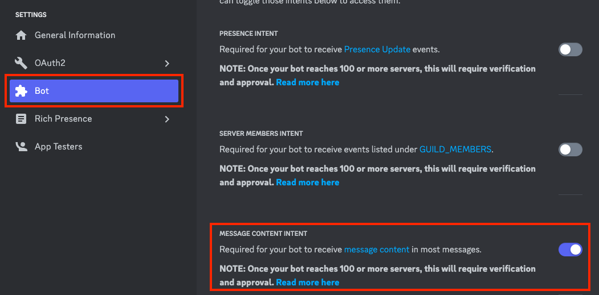

# ChatGPT を使って Discord の Public channel をまとめて要約するスクリプト

by [1RO8s](https://twitter.com/kizzo168) 2023-[APACHE LICENSE, 2.0](https://www.apache.org/licenses/LICENSE-2.0)

ChatGPTを使ってDiscordのPublic channnelの要約を投稿するスクリプトです。

[masuidrive](https://twitter.com/masuidrive)さんが開発された[Slack版](https://github.com/masuidrive/slack-summarizer)をもとにしています・


OpenAI の情報取扱に関する規約は下記などを確認してください。

https://platform.openai.com/docs/data-usage-policies


## GitHub Actionsで動かす

GitHub Actions で毎日午前5時に動くようになっています。

### 自分のGitHubアカウントにforkする
- 右上の"Fork"ボタンを押して、自分のリポジトリにforkします
- 有料プランにするなどして GitHub Actions が実行できるようにしておきます

### 環境変数を設定する
- "Settings"タブを開き、左の"Secrets and variables" -> "Actions"を開きます
- 右上の緑の"New Repository Secret"をクリックすると環境変数が設定できるので、次の 4 つの変数を設定します


#### DISCORD_TOKEN

#### OPEN_AI_TOKEN
- OpenAI の認証トークン
- [OpenAI の Web サイト](https://platform.openai.com/)にアクセスしてください
- 右上の"Sign In"ボタンをクリックし、アカウントにログインしてください
- ページ上部の"API"メニューから、"API Key"をクリックして、API キーを生成します
- "API Key"ページにアクセスすると、API キーが表示されます。これをコピーして Value に貼り付けます

#### SERVER_ID
- 対象のサーバーに移動後、サーバー名を右クリックして、メニューから「IDをコピー」を選択
> IDを確認するには[開発者モードを有効化](#開発者モードの有効化)する

#### SUMMARY_CHANNEL_ID
- ユーザー設定を開き、詳細設定 -> 開発者モードをONにする

- 対象のサーバーに移動後、サーバー名を右クリックして、メニューから「IDをコピー」を選択

### botの作成

[Botアカウント作成](https://discordpy.readthedocs.io/ja/latest/discord.html)


### 権限設定
Developer Portal
- Bot -> MESSAGE CONTENT INTENTを有効化する


### botの招待
YOUR_CLIENT_IDにはbotのclient idを設定

以下のURLを開いて、対象のサーバーにbotを招待してください
```
https://discord.com/api/oauth2/authorize?client_id=YOUR_CLIENT_ID&permissions=67584&scope=bot
```

#### 開発者モードの有効化
- ユーザー設定を開き、詳細設定 -> 開発者モードをONにする
